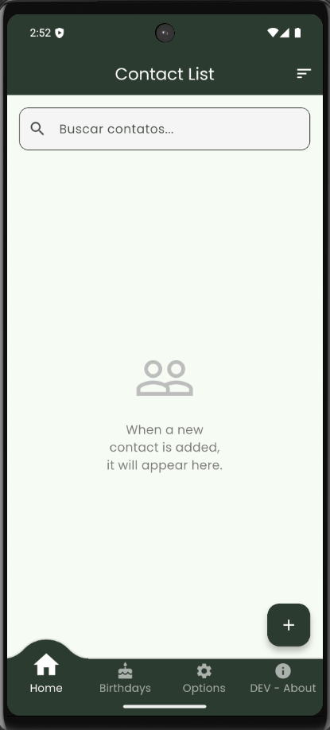
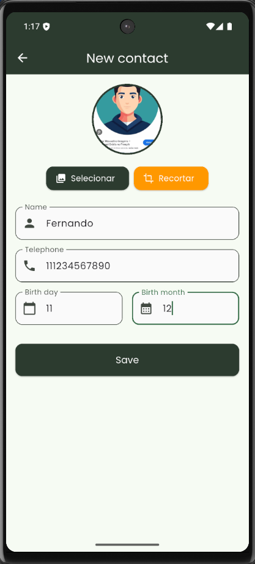
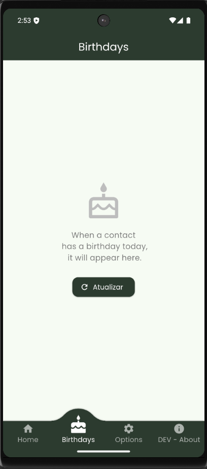
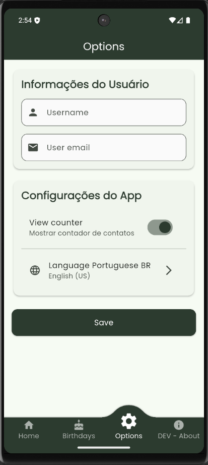
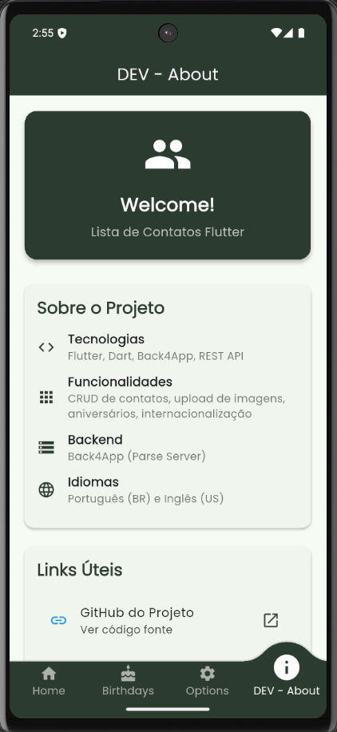

# Lista de Contatos Flutter

Um aplicativo completo de lista de contatos desenvolvido com Flutter, seguindo o desafio da DIO (Digital Innovation One).

## 🚀 Funcionalidades

- **CRUD de Contatos**: Criar, visualizar, editar e excluir contatos
- **Upload de Imagens**: Selecionar e recortar fotos de perfil
- **Aniversários**: Tela especial para contatos que fazem aniversário hoje
- **Ligações e WhatsApp**: Ligar diretamente para contatos ou abrir WhatsApp
- **Compartilhamento**: Compartilhar informações dos contatos
- **Internacionalização**: Suporte para Português (BR) e Inglês (US)
- **Busca e Ordenação**: Buscar contatos e ordenar por nome (A-Z/Z-A)
- **Configurações**: Personalizar informações do usuário e preferências

## 📱 Telas do App

### Lista de Contatos


### Detalhe do Contato


### Aniversariantes


### Opções


### Sobre o Desenvolvedor


## 🛠️ Tecnologias Utilizadas

- **Flutter/Dart** - Framework principal
- **Back4App** - Backend as a Service (BaaS)
- **Dio** - Cliente HTTP para requisições
- **Easy Localization** - Internacionalização
- **Image Picker** - Seleção de imagens
- **Image Cropper** - Recorte de imagens
- **Shared Preferences** - Armazenamento local
- **URL Launcher** - Abrir links externos
- **Share Plus** - Compartilhamento
- **Convex Bottom Bar** - Navegação inferior
- **Google Fonts** - Tipografia

## 📁 Estrutura do Projeto

```
lib/
├── config/
│   └── env_config.dart          # Configurações do Back4App
├── models/
│   └── contato.dart             # Modelo de dados do contato
├── screens/
│   ├── main_screen.dart         # Tela principal com navegação
│   ├── home_screen.dart         # Lista de contatos
│   ├── contato_form_screen.dart # Formulário de contato
│   ├── aniversarios_screen.dart # Tela de aniversários
│   ├── opcoes_screen.dart       # Configurações
│   └── dev_screen.dart          # Informações do projeto
├── services/
│   └── api_service.dart         # Serviço de API
├── utils/
│   ├── image_utils.dart         # Utilitários de imagem
│   └── validation_utils.dart    # Validações
├── widgets/
│   ├── contato_card.dart        # Card do contato
│   └── ordenacao_dialog.dart    # Diálogo de ordenação
└── main.dart                    # Ponto de entrada do app
```

## 🎨 Design

O app utiliza um design moderno com:
- **Cores**: Paleta baseada em tons de marrom (#BC764A, #D0996F)
- **Tipografia**: Google Fonts (Poppins)
- **Material Design 3**: Componentes modernos do Flutter
- **Responsividade**: Adaptável a diferentes tamanhos de tela

## 📊 Funcionalidades Detalhadas

### Gestão de Contatos
- Adicionar novos contatos com foto, nome, telefone e data de nascimento
- Editar informações existentes
- Excluir contatos com confirmação
- Validação de dados em tempo real

### Upload de Imagens
- Seleção de imagens da galeria
- Recorte de imagens com diferentes proporções
- Upload automático para o Back4App
- Fallback para imagem padrão em caso de erro

### Aniversários
- Detecção automática de aniversários do dia
- Interface especial com animações
- Contador de aniversariantes

### Comunicação
- Ligações diretas para contatos
- Abertura do WhatsApp com número formatado
- Compartilhamento de informações dos contatos

### Configurações
- Informações pessoais do usuário
- Preferências do app
- Seleção de idioma
- Persistência local com SharedPreferences

## 🌐 Internacionalização

O app suporta dois idiomas:
- **Português (BR)** - Idioma padrão
- **Inglês (US)** - Idioma alternativo

Arquivos de tradução em `assets/translations/`

## 🔒 Permissões

O app requer as seguintes permissões:
- **Câmera**: Para capturar fotos
- **Galeria**: Para selecionar imagens
- **Telefone**: Para fazer ligações
- **Internet**: Para comunicação com o backend

## 📱 Compatibilidade

- **Android**: API 21+ (Android 5.0+)
- **iOS**: iOS 11.0+
- **Web**: Suporte experimental

## 🤝 Contribuição

1. Faça um fork do projeto
2. Crie uma branch para sua feature (`git checkout -b feature/AmazingFeature`)
3. Commit suas mudanças (`git commit -m 'Add some AmazingFeature'`)
4. Push para a branch (`git push origin feature/AmazingFeature`)
5. Abra um Pull Request

## 📄 Licença

Este projeto está sob a licença MIT. Veja o arquivo [LICENSE](LICENSE) para mais detalhes.

## 👨‍💻 Desenvolvedor

Desenvolvido como parte do desafio da DIO - Digital Innovation One.

## 🙏 Agradecimentos

- [DIO](https://dio.me) - Plataforma de educação
- [Flutter](https://flutter.dev) - Framework de desenvolvimento
- [Back4App](https://back4app.com) - Backend as a Service
- Comunidade Flutter por todo o suporte
